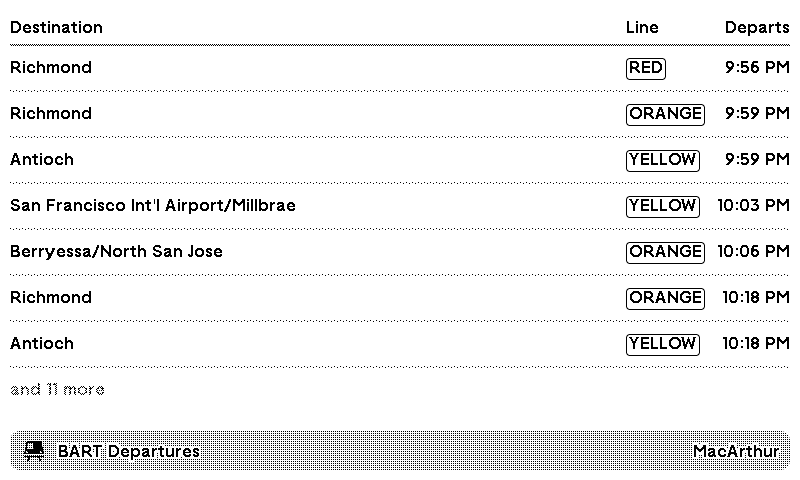
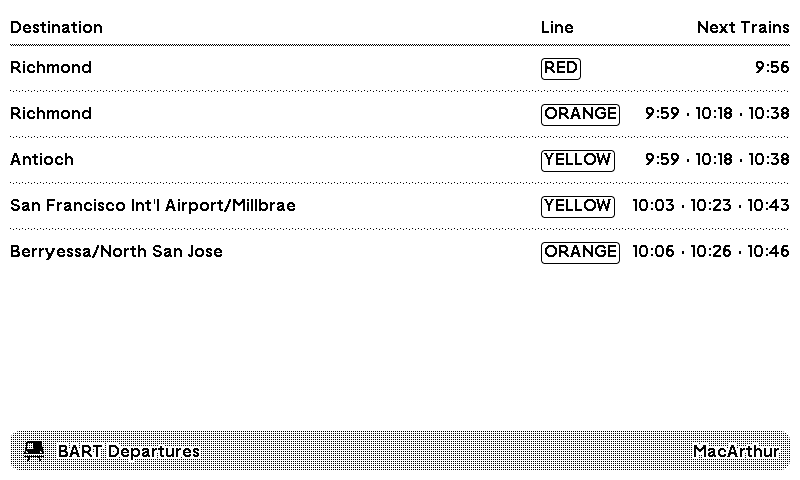

# bart-departures-trmnl-plugin
A custom plugin for [TRMNL](https://trmnl.com/) e-ink display to view upcoming BART (Bay Area Rapid Transit) departures for your local station!

## Overview

BART Departures shows upcoming Bay Area Rapid Transit trains for your station, using real-time data from 511.org. Each row shows the train's destination, its line and when it departs. This makes it easy to check your next train before you head out the door.

To get started, request a free API token at https://511.org/open-data/token and paste it into the plugin settings. Then pick your station from the full list of BART stops.

Settings let you tailor the display:

- **Direction:** show all trains, or only northbound or southbound.
- **Line(s):** show only the lines you ride, such as Red and Yellow, or keep "All lines."
- **Layout:** list every departure in time order, or group by destination to see the next three trains for each route on a single row, similar to BART's platform signs.
- **Text size:** Small, Medium or Large. Larger text is easier to read from across the room and shows fewer trains.

The plugin works in full, half and quadrant layouts, so it fits alongside your other plugins in a mashup.

Happy BARTing!

## Display Examples

List layout:

Group by destination layout:

## Repo layout

This repo is kept in sync with TRMNL via the TRMNL GitHub sync, using the [trmnlp](https://github.com/usetrmnl/trmnlp) layout:

- `src/settings.yml` – plugin settings (polling URL, refresh interval, custom form fields)
- `src/transform.js` – transforms the 511 StopMonitoring response into a small `departures` list
- `src/shared.liquid` – markup shared across all layouts
- `src/full.liquid`, `src/half_horizontal.liquid`, `src/half_vertical.liquid`, `src/quadrant.liquid` – per-size markup
- `.trmnlp.yml` – local preview config for `trmnlp serve`
- `examples/example-511-payload.json` – sample 511 API response for reference

## TODO

- better half & quadrant markup
