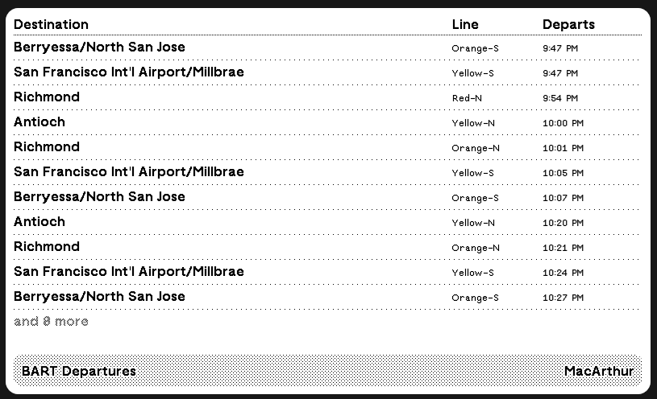

# bart-departures-trmnl-plugin
A custom plugin for [TRMNL](https://trmnl.com/) e-ink display to view upcoming BART (Bay Area Rapid Transit) departures for your local station!

To use, request an API token from https://511.org/open-data/token

Display Example:

## Repo layout

This repo is kept in sync with TRMNL via the TRMNL GitHub sync, using the [trmnlp](https://github.com/usetrmnl/trmnlp) layout:

- `src/settings.yml` – plugin settings (polling URL, refresh interval, custom form fields)
- `src/transform.js` – transforms the 511 StopMonitoring response into a small `departures` list
- `src/shared.liquid` – markup shared across all layouts
- `src/full.liquid`, `src/half_horizontal.liquid`, `src/half_vertical.liquid`, `src/quadrant.liquid` – per-size markup
- `.trmnlp.yml` – local preview config for `trmnlp serve`
- `examples/example-511-payload.json` – sample 511 API response for reference

## TODO

- better half & quadrant markup
